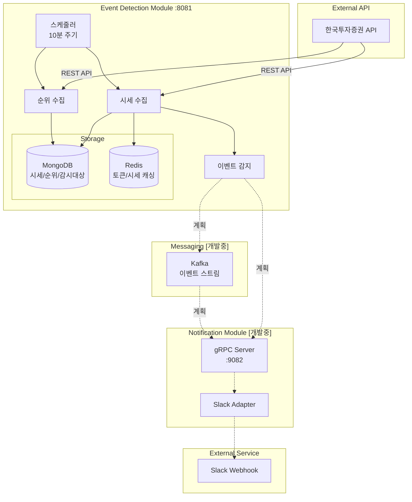

# MarketPulse - 실시간 금융 시세 감지 시스템

한국투자증권 API와 연동하여 실시간 시세를 수집하고 급등/급락 이벤트를 감지하여 알림을 발송하는 시스템입니다.


## 시스템 아키텍처



## 기술 스택

- **Java 21** + **Spring Boot 3.2** + **Spring WebFlux**
- **MongoDB** (시계열 데이터, TTL 인덱스)
- **Redis** (API 토큰/시세 캐싱)
- **gRPC** + **Kafka** (마이크로서비스 통신)
- **Docker Compose** + **Testcontainers**

## 모듈 구조

### **event-detection** (포트: 8081)
- 종목 마스터 데이터 관리 (`Stock`)
- 실시간 시세 수집 (`StockPrice`, TTL 24시간)
- 시장 순위 분석 (`MarketRanking`, 상승/하락/거래량 TOP 30)
- 감시 대상 관리 (`WatchTarget`, CORE/THEME/MOMENTUM)
- 알림 쿨다운 관리 (`AlertHistory`, 1시간)
- KIS API 연동 (토큰 관리, 시세/순위 조회)
- 스케줄러 (10분 주기 데이터 수집)

### **notification** (포트: 8082, gRPC: 9082)
- gRPC 서버 (비동기 알림 처리)
- Slack Webhook 연동
- 알림 템플릿 관리

### **messaging-kafka**
- 이벤트 Producer/Consumer
- 비동기 이벤트 스트리밍
- 테스트 환경 구성 (Testcontainers)

### **common**
- 암호화 서비스 (Jasypt)
- MongoDB/Redis 설정
- 예외 처리 (RestControllerAdvice, ExceptionHandler)
- 공통 API 응답 (Sealed interface, Record Pattern, Switch Pattern Matching)
- 공통 에러 (Enum)
- AOP (Logging, Result)

## 핵심 구현

### 헥사고날 아키텍처
```
├── domain/                # 순수 도메인 (프레임워크 독립)
│   ├── model/             # 엔티티, 값 객체
│   └── service/           # 도메인 서비스
├── application/           # 애플리케이션 계층
│   ├── port/in/           # 유스케이스 인터페이스
│   ├── port/out/          # 외부 시스템 포트
│   └── service/           # 유스케이스 구현
└── infrastructure/        # 인프라 계층
    ├── adapter/in/        # REST, gRPC, Scheduler
    └── adapter/out/       # MongoDB, Redis, KIS API
```


## 구현 완료 기능

### 1. 시세 데이터 수집 및 관리
- KIS API 토큰 자동 발급/갱신 (Redis 캐싱)
- 실시간 시세 조회 (개별/배치)
- MongoDB TTL 인덱스 (24시간 자동 삭제)
- Redis 캐싱 (5분 TTL)

### 2. 시장 순위 분석
- 상승률/하락률/거래량 TOP 30 수집
- 10분 주기 자동 수집 스케줄러
- 상위 10위 종목 자동 WatchTarget 등록
- 7일간 순위 데이터 보관

### 3. 감시 대상 관리
- CORE: 핵심 관심 종목 (삼성전자, SK하이닉스 등)
- THEME: 테마 종목 (AI, 반도체 관련)
- MOMENTUM: 급등락 감지 종목
- 자동 초기화 (16개 주요 종목)

### 4. 데이터 초기화
- StockDataInitializer: 주요 종목 마스터 데이터
- WatchTargetInitializer: 감시 대상 설정

## 미구현 기능 (TODO)

### 1. 이벤트 감지 엔진
- 급등/급락 감지 로직 (변동률 기준)
- 거래량 급증 감지
- 52주 신고가/신저가 감지

### 2. 알림 시스템
- gRPC 서버 구현
- Slack Webhook 연동
- 알림 템플릿 관리
- 알림 이력 관리

### 3. Kafka 이벤트 스트리밍
- Producer/Consumer 구현
- 이벤트 스키마 정의
- DLQ (Dead Letter Queue) 처리

### 4. API 및 문서화
- REST API 엔드포인트
- OpenAPI 3.0 문서
- API 인증/인가

### 5. 모니터링
- Micrometer 메트릭
- Health Check 엔드포인트
- 로그 집계 (ELK)

## 주요 특징

- **Reactive Programming**: WebFlux 기반 비동기 처리
- **도메인 중심 설계**: 헥사고날 아키텍처 + DDD
- **이벤트 기반**: Kafka + gRPC 통신 (계획)
- **캐싱 전략**: Redis (Hot Data) + MongoDB TTL (Cold Data)
- **중복 알림 방지**: AlertHistory 쿨다운 (1시간) (계획)


